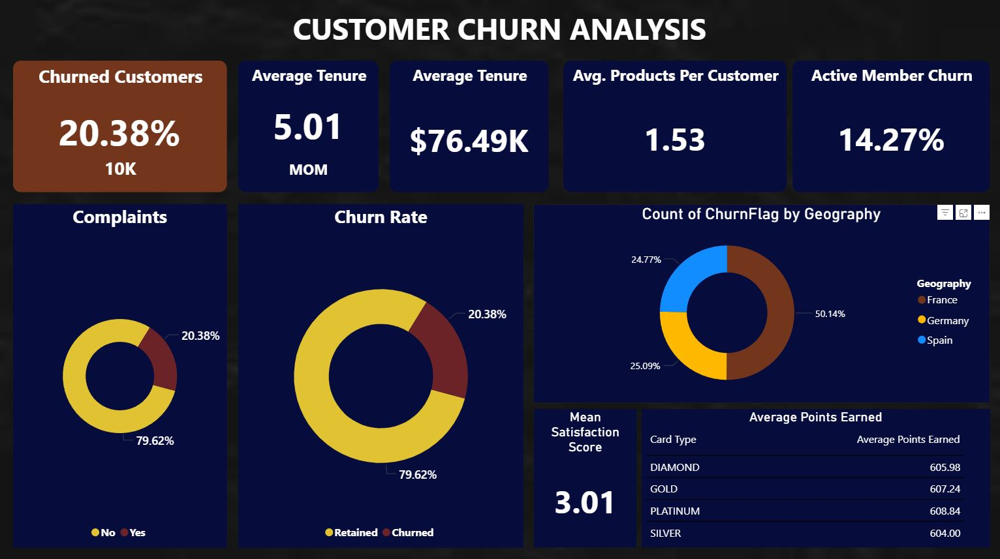

# Bank Churn Analysis

## Table of Contents

- [Project Overview](#project-overview)
- [Data Sources](#data-sources)
- [Data Analysis](#data-analysis)
- [Findings](#findings)
- [Recommendations](#recommendations)


### Project Overview

This data analysis project explores the churn rate of a fictional bank using SQL and Power BI. The goal was to identify patterns and key drivers behind customer attrition. I analyzed variables such as customer satisfaction, credit score, complaints, and active membership to uncover insights into churn behavior.

To simulate a real world business environment, I used ChatGPT to act as a Product Manager and as a Stakeholder to define business goals and KPIs. This project was completed entirely without following any YouTube tutorials, allowing me to demonstrate my independent problem solving skills and ability to manage a data project from start to finish. It serves as a showcase of my growing skill set as an aspiring data analyst.




### Data Sources

Bank Churn Data: The main dataset used in this project is the "Customer-Churn-Records.xlsx" file, which includes detailed records of customers that stayed and left the bank. 


### Tools

Microsoft Excel – Initial data inspection, formatting, and column cleanup of the .xlsx dataset

SQL Server Management Studio (SSMS) – Data cleaning, transformation, and exploratory analysis

Power BI – Interactive dashboard creation, KPI tracking, and data visualization

ChatGPT – Simulated stakeholder collaboration to define KPIs and business goals


### Data Cleaning / Preparation

During the data preparation phase, I performed several steps to ensure the dataset was clean, consistent, and ready for analysis:

1. Loaded the original `.xlsx` file into Microsoft Excel to inspect the data and clean unnecessary columns such as `RowNumber` and `Surname`.
2. Verified there were no duplicate rows using Excel and SQL queries in SQL Server Management Studio.
3. Created calculated columns such as `ChurnFlag` and `ComplaintLabel` using SQL `CASE` statements in PowerBI for better readability.
4. Standardized and validated data types for each column to ensure numerical fields like `Balance` and `CreditScore` were properly typed.
6. Loaded the cleaned dataset into Power BI for analysis and visualization.


### Exploratory Data Analysis

EDA involved exploring the bank churn data to answer key questions, such as:

KPI's Requirement
- Total Customers
- Churn Rate
- Average Tenure
- Average Balance
- Product Holding Ration
- Active Member Churn Rate
- Complain Rate
- Average Satisfaction Score
- Average Points by Card Type
- Churn by Geography

### Data Analysis

Here are some of the most impactful queries I used during the data analysis process

Learned how to check for Ducplicates using SQL
```sql
SELECT 
    CustomerId, Surname, CreditScore, Geography, Gender, Age, Tenure,
    Balance, NumOfProducts, HasCrCard, IsActiveMember, EstimatedSalary,
    Exited, Complain, Satisfaction_Score, Card_Type, Point_Earned,
    COUNT(*) AS CountOfDuplicates
FROM BankCustomerData
GROUP BY 
    CustomerId, Surname, CreditScore, Geography, Gender, Age, Tenure,
    Balance, NumOfProducts, HasCrCard, IsActiveMember, EstimatedSalary,
    Exited, Complain, Satisfaction_Score, Card_Type, Point_Earned
HAVING COUNT(*) > 1;
```

Also learned how to check for Null and Black values
``` sql
SELECT * 
FROM [Customer-Churn-Records]
WHERE Surname IS NULL
OR Surname = ''”;
```

Churn Rate in terms of %
```sql
SELECT
(SELECT EXITED FROM [Customer-Churn-Records] WHERE EXITED = 1) / COUNT(Exited)
FROM [Customer-Churn-Records];
```

Added a Yes/No Column for Churned customer for better readability for Steak Holders
```sql
ALTER TABLE [Customer-Churn-Records]
ADD ChurnFlag AS 
  CASE 
    WHEN Exited = 1 THEN 'Yes'
    ELSE 'No'
  END;
```

Active members who still decided to Churn
```sql
SELECT
CAST
(SUM(CASE WHEN Exited = 1 THEN 1 ELSE 0 END) AS FLOAT) /
COUNT(*) * 100 AS ChurnRatePercentage
FROM [Customer-Churn-Records]
WHERE IsActiveMember = 1;
```
Average points by card type
```sql
SELECT CARD_TYPE, AVG(Point_Earned) AS 'Average Points Earned'
FROM [Customer-Churn-Records]
GROUP BY Card_Type
ORDER BY AVG(Point_Earned) DESC;
```

### Findings
The raw data alone didn’t reveal many standout patterns, while creating visual dataset in PowerBI I uncovered several important insights:

1. Customers who churned tend to have higher estimated salaries compared to those who stayed, suggesting income level alone may not indicate satisfaction.
2. 100% of customers who submitted a complaint eventually churned, indicating a strong correlation between complaints and customer loss.
3. Germany has the highest churn rate among all regions analyzed, making it a priority area for customer retention strategies.
4. Churn rate trends closely mirror complaint statistics, which reinforces the idea that unresolved or poorly handled complaints may be a key driver of attrition.
5. Active members still contributed to churn, showing that activity alone is not a guaranteed indicator of loyalty.
6. Customers with fewer bank products had a higher tendency to churn.
7. Satisfaction score averages were noticeably lower for churned customers, confirming it as a strong predictive indicator of churn.


### Recommendations
Based on my analysis, I recommend the following actions:
- Strengthen customer support efforts to improve satisfaction and reduce churn. Especially among customers who have submitted complaints.
- Target the German customer base with region-specific retention campaigns, such as personalized outreach or exclusive benefits to address the higher churn rate.
- Implement a loyalty program that rewards long-term customers to give them a greater incentive to remain with the bank over time.
- Encourage cross-selling to new customers, as those with fewer products were more likely to leave. Offering relevant services early can increase engagement and retention.
- Conduct customer satisfaction surveys to better understand what drives high satisfaction scores, then apply those insights across all regions to improve the overall customer experience.

### References
1. Kaggle Data Set from Radheshyam Kollipara
   - [Data Set](https://www.kaggle.com/datasets/radheshyamkollipara/bank-customer-churn)
